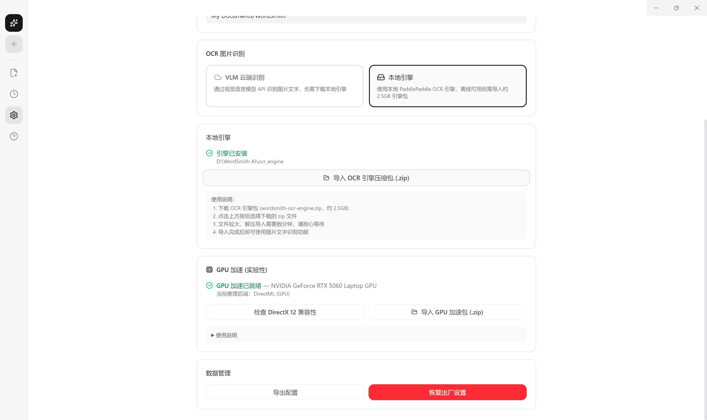

 [简体中文](README.md) | [English](README.en-US.md)
 ## 📄 Open Source License
This project is open-sourced under the [GPL v3](LICENSE) license.

<p align="center">
  
</p>

<h1 align="center">WordSmith AI (Smart Formatting Wizard)</h1>
<p align="center">An AI-powered Word formatting tool based on HTML</p>

---

## 📱 User Guide

### 🎯 Program Introduction
WordSmith AI is a convenient formatting tool that leverages HTML format and strict prompt constraints to interact with AI for article paragraph formatting, which can then be copied and pasted back into Word. It also supports rendering mathematical and physical formulas. The tool allows AI to directly generate articles, format content by imitating existing paragraphs from Word documents, and clean HTML content copied from web pages to precisely comply with Word's formatting capabilities. The latest version supports OCR image recognition with two modes:

- **Local OCR (Recommended)**: GPU-accelerated pipeline based on ONNX Runtime + DirectML, supporting layout analysis, text detection and recognition, outputting Markdown-formatted text. Works with all GPU vendors (NVIDIA / AMD / Intel), no internet required.
- **Cloud OCR**: Online inference via VLM (Vision Language Model), requires API Key from a service provider and selecting a vision model.

Recognition results support manual correction. Users can directly upload or drag-and-drop images for text recognition.

Additionally, v1.2.0 introduces a **LaTeX Formula Editor** (sidebar Σ entry), supporting:
- Real-time KaTeX preview + LaTeX → UnicodeMath conversion (paste into Word, press Alt+= then Space to build the formula)
- High-DPI image export (4x super-sampling + smart crop + DPI metadata matching Word 11pt font)
- AI Formula Assistant (streaming chat to generate LaTeX, one-click insert) + context count control
- Staircase dual-panel layout (AI assistant + history can open simultaneously)

### Smart Context Control

Fine-grained control over the conversation context sent to AI, optimizing formatting quality and saving tokens:

- **Round Slider**: Set the most recent N rounds (0~20) of conversation to participate in AI reasoning, unlimited by default
- **Per-round Toggle**: Each completed round has a checkbox to manually include/exclude, overriding the default window rule
- **Pin History Rounds**: Pin valuable conversation snippets from history as cross-session context snapshots, stored independently — deleting history does not affect pinned rounds
- **Regenerate / Continue**: Regenerate the last AI reply or continue from where it was interrupted

### Update Detection

Automatically checks for new versions on startup:

- Displays new version number, release date, and changelog
- Supports "Remind Me Later" (no popup for 3 days) and "Skip This Version" (never popup for same version)
- Shows an extra warning if OCR engine architecture has changed, reminding users to re-import OCR engine packs after updating
- Red dot indicator on sidebar settings icon (disappears after user takes action)
- View current version and update details in Settings "General" tab, with manual check button
- User data and OCR engine are preserved during overlay installation, no reconfiguration needed
- Opens download link in system default browser

### 📥 Installation Instructions
1. Download the latest version of the .exe installer (Current latest: **v1.2.1**).
2. **OCR functionality** requires additional engine packages, configured in "Settings → Advanced → OCR Image Recognition":
   - **Local OCR**: Import `wordsmith-ocr-engine.zip` (OCR engine, ~1.8GB) and `wordsmith-gpu-pack.zip` (GPU acceleration pack, ~317MB). DirectML GPU acceleration is enabled automatically after import; falls back to CPU when no GPU is available.
   - **Cloud OCR**: Enter the API Key from your service provider and select a vision model.

<p align="center">
  
</p>

---

## 🛠️ Developer Guide

### Tech Stack
Electron 30 + React 18 + TypeScript + Tailwind CSS v4 + Zustand + Vite

### Environment Setup

```bash
# 1. Install dependencies (add mirror for slow Electron downloads in China)
$env:ELECTRON_MIRROR="https://npmmirror.com/mirrors/electron/"; npm install

# 2. Start development
npm run dev

# 3. Package the application
npm run build
```

### Formatting Protocol

Core Constraints — Ensure HTML pasted into Word has correct formatting:
- Inline styles only, `<style>` tags are prohibited
- Units must be `pt` (Guard Layer automatically converts px→pt by ×0.75)
- Tables use `align="center"` and `width:440pt; border-collapse:collapse;`
- Mathematical formulas retain `$...$` / `$$...$$` as-is, MathML is removed

### OCR Engine
The OCR engine is not included in the installer. Users import it via "Settings → Advanced".

**Local OCR Pipeline (v1.1.2)**:
- Based on 3 ONNX models: layout analysis (PP-DocLayout) + text detection (PP-OCRv5 det) + text recognition (PP-OCRv5 rec)
- GPU acceleration: ONNX Runtime + DirectML, supports NVIDIA / AMD / Intel GPUs
- ~1.8–2.4s per image (GPU), auto-fallback to CPU when no GPU is available
- Core script: `ocr_engine/onnx_pipeline.py`, called from TypeScript via `execFile`

**Distribution package build**:
```powershell
# OCR engine pack (~1.8GB)
powershell -ExecutionPolicy Bypass -File scripts/pack-ocr-engine.ps1

# GPU acceleration pack (~317MB)
pwsh scripts/prepare-gpu-pack.ps1
```

During development, place the `ocr_engine/` directory in the project root for automatic detection. See `docs/OCR模块技术文档.md` for technical details.

## 📄 Open Source License (License)
This project is licensed under the [GPL v3 License](LICENSE).
>   

⚖️ License & Copyright  
The copyright of this project (including but not limited to source code, documentation, resource files, etc.) is owned by the original author (myself).  

License Terms:  

1. **Unified Authorization**: All historical versions, branches, and subsequent updates of this project, starting from the first commit (Initial Commit), are now uniformly authorized under the GNU General Public License v3.0 (GPLv3).  

2. **Retroactive Effect Declaration**: Regardless of whether you obtained the source code before or after the addition of the LICENSE file to this project, any distribution, modification, or use of this project's code must strictly comply with all terms of the GPLv3 license.  

3. **Closed-Source Restriction**: No individual or organization is permitted to use this project's code for commercial closed-source software, package it into .exe or other binary forms for distribution, without fulfilling the obligations of the GPLv3 (such as open-sourcing the derivative project's source code).  

4. **Infringement Action**: Any violation of the GPLv3 license shall be deemed as direct infringement of copyright. I reserve the right to pursue legal action (including but not limited to submitting DMCA/takedown requests to hosting platforms, filing judicial lawsuits, etc.) against infringers.  

Notice: If you wish to use this project's code without complying with the GPLv3 license (e.g., keeping it closed-source), you must contact the author to obtain a separate commercial license.

## 📫 联系我 (Contact)
If you have any suggestions or need a commercial license, feel free to contact us via email: zkydw.dev@outlook.com