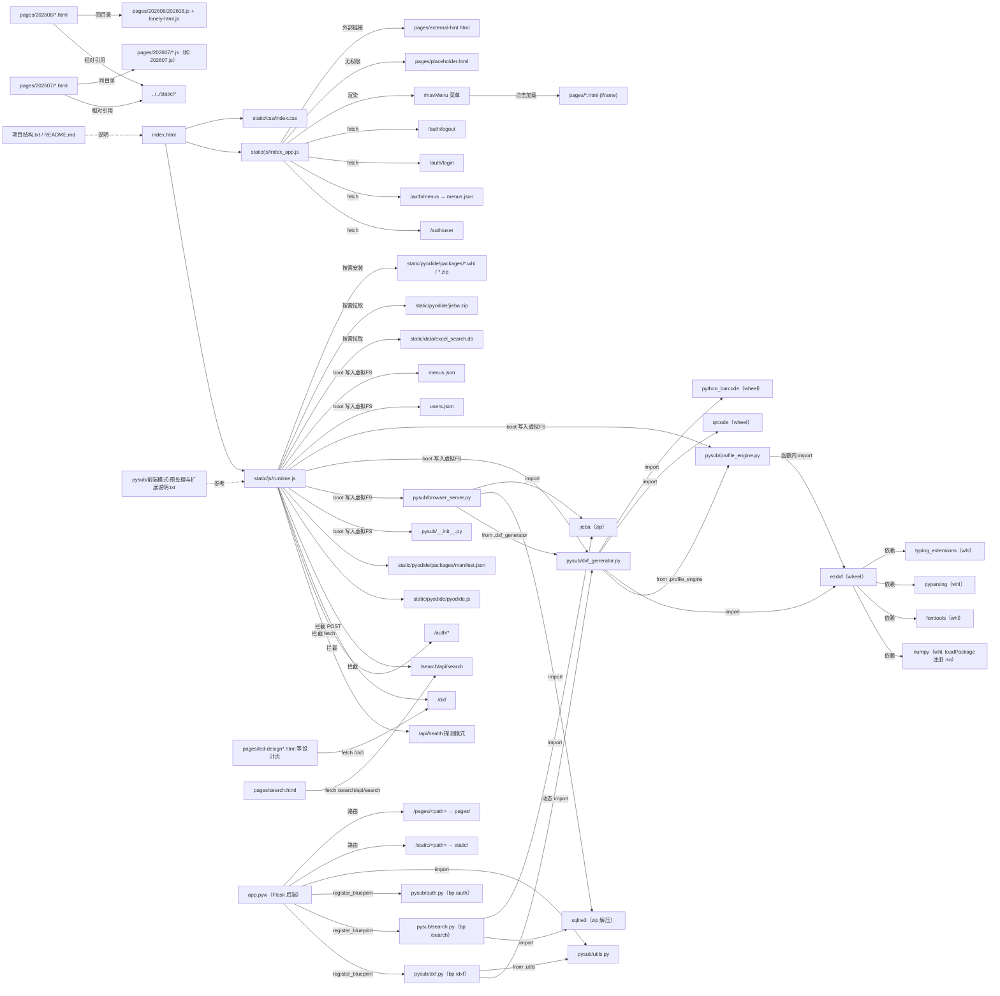

# htmlstars 文件依赖关系图

> 用途：从任意一个文件出发，沿箭头即可找到与之关联的其他文件。
> 箭头含义：`A --> B` 表示 A 引用 / 加载 / 依赖 / 调用 B。
> 渲染方式：VS Code 安装 Mermaid 插件，或粘贴到 https://mermaid.live 。

## 双模对应关系（最容易看串的地方）

| 功能 | 前端 Pyodide 模式 | 后端 Flask 模式 |
|------|------------------|------------------|
| 模式探测 | `runtime.js` 拦截 `/api/health` 得 404 → frontend | `app.pyw` 提供 `/api/health` 200 → backend |
| 绘图 /dxf | `pysub/browser_server.py` 在 Pyodide 内 `runPython` 执行 | `pysub/dxf.py` (Blueprint) |
| 搜索 /search | 同上 `browser_server.search_api` + sqlite3/jieba | `pysub/search.py` (Blueprint) |
| 登录 /auth | `runtime.js` fallback 到内置 `users.json`/`menus.json` | `pysub/auth.py` (Blueprint) |
| 重型依赖 | 离线包（numpy/ezdxf/sqlite3/jieba） | pip 环境（`加载pip环境.pyw`）|

## 快速索引（从关键文件顺藤摸瓜）

- **改了 `runtime.js`** → 必须同步升 `RUNTIME_VERSION` 并改 8 处 HTML 的 `?v=` 强刷；它决定走哪套模式、加载哪些离线包。
- **绘图报错** → 查 `dxf_api` → `browser_server.dxf_generate` → `dxf_generator.py` → 离线包清单 `manifest.json`。
- **搜索报错** → 查 `search_api` → `browser_server.search_api` → `sqlite3`/`jieba` 离线包 + `excel_search.db`。
- **页面打不开 / 0 应用** → 查该页 `static/` 引用是否为相对路径（部署在子路径 `/v1/` 时空 `/static/` 会 404）。
- **本地后端起不来** → 查 `app.pyw` → 各 Blueprint → `pysub/utils.py`。
